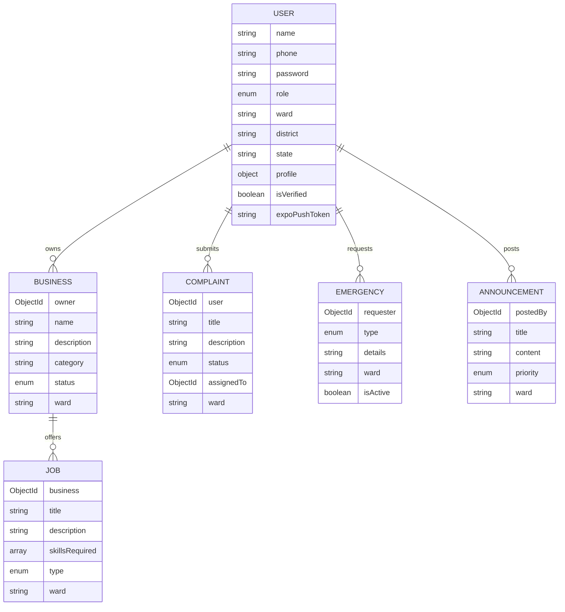

# Ward - Digital Community Platform

## Overview

**Ward** is a comprehensive ward-by-ward digital community application designed for India, inspired by the Panchayat governance system. The platform connects citizens with local governance, businesses, and community services at the ward level.

---

## 🎯 Core Purpose

| Goal | Description |
|------|-------------|
| **Local Governance** | Enable transparent communication between citizens and ward representatives |
| **Employment** | Facilitate job opportunities and business visibility within wards |
| **Emergency Support** | Provide blood donation, medical, and disaster emergency services |
| **Citizen Networking** | Connect verified citizens within their local communities |

---

## 🏗️ Architecture

```
ward/
├── backend/          # Node.js Express REST API
│   └── src/
│       ├── controllers/   # Request handlers
│       ├── models/        # MongoDB schemas
│       ├── routes/        # API endpoints
│       ├── middleware/    # Auth & validation
│       └── services/      # Business logic
│
└── mobile/           # React Native Expo App
    └── src/
        ├── screens/       # UI screens
        ├── components/    # Reusable components
        ├── context/       # State management
        ├── navigation/    # App routing
        └── services/      # API integration
```

---

## 🔐 User Roles & Permissions

| Role | Permissions |
|------|-------------|
| **Citizen** | View announcements, submit complaints, access emergency services, browse businesses/jobs |
| **Business** | Submit business listings, post job openings, all citizen permissions |
| **Ward Member** | Post announcements, manage complaints, all business permissions |
| **Admin** | Full system access, user management, business approval, content moderation |

---

## 📱 Features

### 1. Authentication
- Phone-based registration with password
- JWT token authentication  
- Secure password hashing with bcrypt
- Role-based access control

### 2. User Profiles
- Personal information (age, gender, blood group)
- Skills and education details
- Employment status tracking
- Ward/District/State location data

### 3. Business Directory
- Business registration with approval workflow
- Categories and contact information
- Image uploads for business listings
- Status tracking: `pending` → `active` / `rejected`

### 4. Job Board
- Job postings linked to businesses
- Employment types: Full-time, Part-time, Contract, Daily-wage
- Skills-based filtering
- Salary range information

### 5. Emergency Services
| Type | Use Case |
|------|----------|
| **Blood** | Blood donation requests with blood group matching |
| **Medical** | Medical emergency alerts |
| **Disaster** | Natural disaster or accident alerts |
| **Other** | General emergency broadcasts |

### 6. Announcements
- Ward-level announcements from officials
- Priority levels: Normal, High, Emergency
- **Push notifications** via Expo SDK

### 7. Complaint Management
- Citizen complaint submission
- Status workflow: `open` → `in-progress` → `resolved` / `rejected`
- Assignment to ward members for resolution

---

## 🛠️ Technology Stack

### Backend
| Technology | Purpose |
|------------|---------|
| **Node.js + Express** | REST API framework |
| **MongoDB + Mongoose** | Database & ODM |
| **JWT** | Authentication tokens |
| **bcryptjs** | Password hashing |
| **Helmet** | Security headers |
| **Multer** | File uploads |
| **Expo Server SDK** | Push notifications |

### Mobile
| Technology | Purpose |
|------------|---------|
| **React Native** | Cross-platform mobile |
| **Expo** | Development framework |
| **React Navigation** | Screen navigation |
| **Axios** | HTTP client |
| **Expo Notifications** | Push notification handling |
| **Expo SecureStore** | Secure token storage |

---

## 📡 API Endpoints

### Authentication
```
POST /api/auth/register     # User registration
POST /api/auth/login        # User login
```

### Users
```
GET    /api/users/profile   # Get current user profile
PUT    /api/users/profile   # Update profile
GET    /api/users/:id       # Get user by ID (admin)
```

### Business
```
GET    /api/business        # List businesses (by ward)
POST   /api/business        # Create business listing
GET    /api/business/:id    # Get business details
PUT    /api/business/:id    # Update business
DELETE /api/business/:id    # Delete business
```

### Jobs
```
GET    /api/jobs            # List job openings
POST   /api/jobs            # Create job posting
GET    /api/jobs/:id        # Get job details
```

### Emergency
```
GET    /api/emergency       # List active emergencies
POST   /api/emergency       # Create emergency request
```

### Announcements
```
GET    /api/announcements   # List announcements
POST   /api/announcements   # Create announcement (admin/ward_member)
```

### Complaints
```
GET    /api/complaints      # List complaints
POST   /api/complaints      # Submit complaint
PUT    /api/complaints/:id  # Update complaint status
```

---

## 📱 Mobile Screens

### Dashboard Module
| Screen | Purpose |
|--------|---------|
| `HomeScreen` | Main dashboard with announcements, emergencies |
| `BusinessListScreen` | Browse local businesses |
| `BusinessSubmissionScreen` | Submit new business listing |
| `ProfileScreen` | View user profile |
| `EditProfileScreen` | Update profile information |

### Admin Module
| Screen | Purpose |
|--------|---------|
| `AdminDashboardScreen` | Admin overview panel |
| `AdminAnnouncementScreen` | Create/manage announcements |
| `AdminBusinessListScreen` | Approve/reject businesses |
| `AdminUserListScreen` | User management |
| `AdSubmissionScreen` | Manage advertisements |

### Auth Module
| Screen | Purpose |
|--------|---------|
| `LoginScreen` | User authentication |
| `RegisterScreen` | New user registration |

---

## 🚀 Getting Started

### Prerequisites
- Node.js v18+
- MongoDB database
- Expo CLI

### Backend Setup
```bash
cd backend
npm install
# Create .env file with:
# MONGODB_URI=your_mongodb_uri
# JWT_SECRET=your_jwt_secret
npm run test   # Starts with nodemon
```

### Mobile Setup
```bash
cd mobile
npm install
npm start      # Starts Expo dev server
```

---

## 🔒 Security Features

- **JWT Authentication** with secure token handling
- **Password Hashing** using bcrypt with salt rounds
- **Helmet.js** for HTTP security headers
- **CORS** configuration for API protection
- **Role-based Access Control** at API level
- **Secure Storage** for mobile tokens (Expo SecureStore)

---

## 🌐 Deployment

The backend is deployed on **Render.com**:
```
https://ward-backend-gbt1.onrender.com/
```

---

## 📊 Database Schema



---

## 👤 Author

**STARK-404**

---

## 📄 License

ISC License
